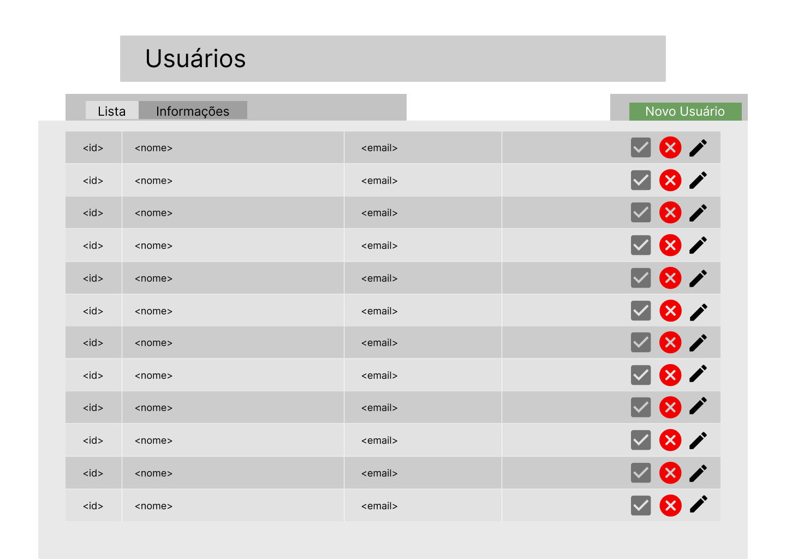
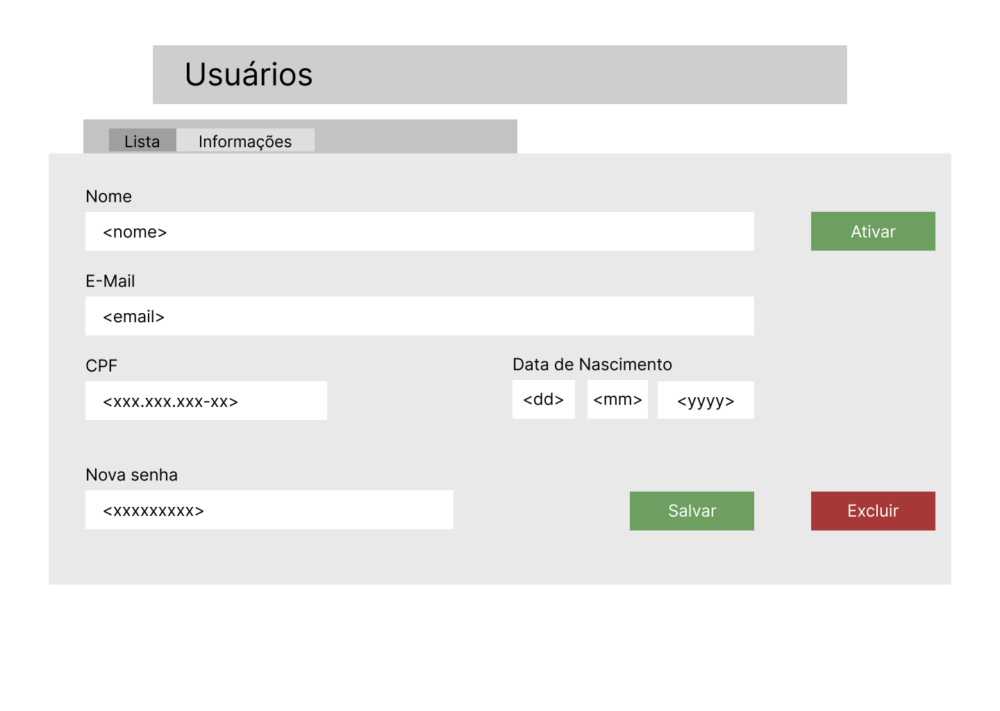
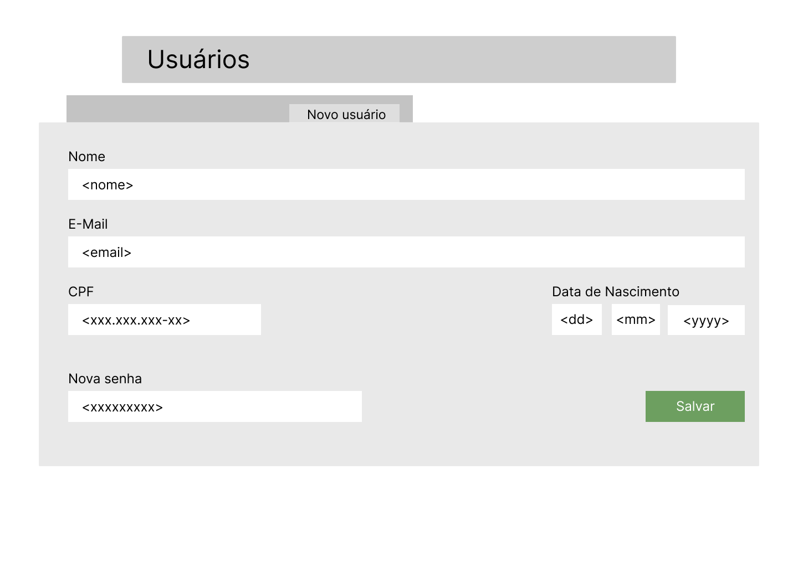

# Teste Front-End FitDance

## Projeto

Você deve criar uma página web que gerencia usuários, integrada a uma API RPC.
A página deve permitir listar todos os usuários, criar um novo usuário, e editar os dados de um usuário existente. Além disto, deve permitir ativar e desativar ou excluir um usuário facilmente por meio de botões na listagem de usuários.

## Detalhamento
Este repositório fornece um back-end que deverá ser integrado à sua página.
A API foi construida utilizando um framework RPC chamado [sdkgen](https://sdkgen.github.io/). Para mais detalhes, veja a documentação e os detalhes na seção de [instruções](#instruções) abaixo.
O projeto de back-end foi construído em Node 20, utilizando typescript e [Yarn PnP](https://yarnpkg.com/features/pnp). Para executar os scripts do projeto, utilize Yarn v4 ou superior. Veja instruções em [Starting with Yarn](https://yarnpkg.com/getting-started/install).
A API fornece ações simples para gestão de usuários, descritas nos arquivos de especificação de API do sdkgen.
O back-end está pré-carregado com 100 cadastros gerados programaticamente. Não será necessário criar cadastros antes de utilizar a API.

## Requisitos
A página deve ser construída utilizando React. Recomendamos a inicialização do projeto com Vite ou NX em vez de create-react-app.
A utilização de libs de componentes pré-fabricados não é proibida, mas daremos preferência a componentes e folhas de estilo CSS construídas manualmente.
A comunicação com a API RPC deve ser feita utilizando o runtime de [sdkgen](https://sdkgen.github.io/) para web. Instruções na documentação e detalhes adicionais na seção de [instruções](#instruções).
Testes automatizados não são obrigatórios.

## Escopo

### Visões:
A página deve ser composta por 3 visões principais:

#### Listagem de usuários:


- Deve listar todos os usuários retornados pela API. Paginação é opcional, já que a API sempre retorna a lista completa.
- Para cada linha, deve exibir a ID, o nome e o e-mail do usuário.
- Os botões na direita devem refletir a situação do usuário
    - O primeiro botão (checkmark) deve refletir se o usuário está ativo ou não, sendo exibido na cor verde quando o usuário está ativo e cinza quando não está ativo ou excluído. Ao clicar neste botão, a página deve realizar a ação de ativação do usuário (descrita abaixo).
    - O segundo botão deve refletir se o usuário está excluído ou não. Deve ser exibido na cor vermelha quando o usuário não tiver sido excluído, e na cor cinza quando já tiver sido excluído. Ao clicar neste botão, a página deve . Caso o usuário tenha sido excluído (botão cinza), a página não deve realizar nenhuma ação.
    - O terceiro botão deve redirecionar para a visão de edição de usuário (abaixo).

#### Edição de usuário:


- Todos os campos nesta página devem ser editáveis.
- Os campos que forem editados devem ser enviados ao backend para atualização do usuário, ao clicar no botão salvar.
- Os botões ativar e excluir devem executar as mesmas ações que os equivalentes na página de listagem (descritas abaixo em [ações](#ações))

#### Criação de usuário:


- Semelhante a página de edição de usuário, exceto pelos botões de ativação e exclusão do usuário.
- Todos os campos são obrigatórios e devem ser preenchidos e enviados a API ao clicar no botão salvar.

### Ações

#### Listagem, consulta, criação e atualização.
Estas ações seguem o padrão CRUD, sem nenhuma regra adicional.

#### Ativação / Desativação do usuário:
A API registra uma flag nos dados de usuário que representa se o mesmo está "ativo" ou não. A ação de ativação e desativação do usuário segue as seguintes regras:

- Caso o usuario esteja ativo e a ação será desativá-lo:
   - A página deve abrir um popup solicitando o motivo da desativação em uma caixa de texto livre, e um botão para confirmação. O campo de motivo não deve ser obrigatório. Ao confirmar, a página deve chamar a API e executar a ativação. O campo de motivo, apesar de retornado pela API, não precisa ser apresentado na página de informações do usuário.
- Caso o usuário esteja inativo e a ação será ativá-lo:
   - A página deve chamar a API diretamente, realizando a ação de ativação do usuário. Note que o campo de motivo de desativação será limpo ao executar esta ação.
- Caso o usuário tenha sido excluído:
   - Nenhuma ação deve ser executada.

#### Exclusão do usuário:
A API implementa um sistema de [soft delete](https://www.tabnews.com.br/LuC45m4Th3u5/voce-sabe-o-que-e-soft-delete). Isto significa que os dados nunca são excluídos do sistema, mas apenas são marcados como "excluídos". A ação de exclusão segue as seguintes regras:

- Caso o usuário não tenha sido excluído:
   - A página deve chamar a API para a ação de exclusão do usuário.
- Caso o usuário já tenha sido excluído:
   - A página não deve executar nenhuma ação.

### Instruções
- Crie um novo repositório em sua conta do Github. O projeto deve ser criado em seu repositório.
- Faça um clone deste repositório e execute a API. O repositório fornece um Dockerfile e docker-compose por conveniência, e scripts de execução no package.json
- Para comunicação com a API, utilize o gerador de cliente do sdkgen, conforme a documentação. Este repositório fornece um script de conveniência para facilitar a geração do cliente web, basta executar:
```bash
yarn gen:client
``` 
O arquivo gerado estará em web/api.ts, e pode ser copiado e colado no seu projeto.
- Faça os commits que julgar necessário em seu repositório, e nos envie um link para que possamos avaliar o projeto.

Caso tenha dúvidas, fique a vontade para entrar em contato.

# Nós da FitDance te desejamos boa sorte!
